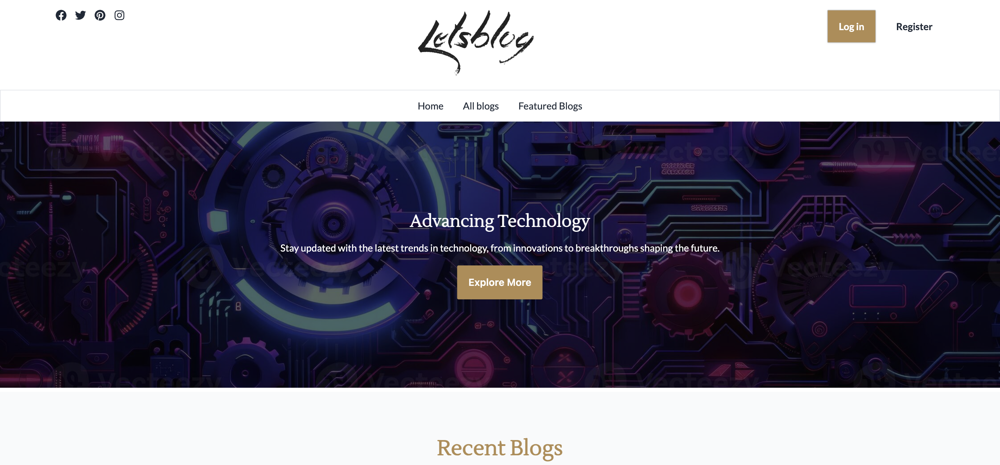
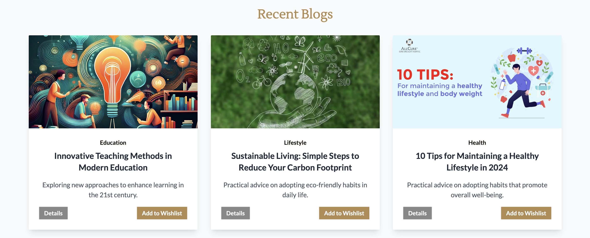
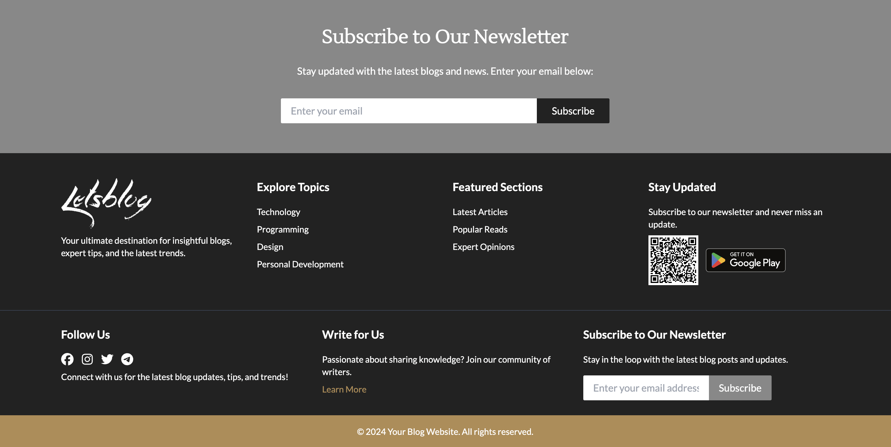
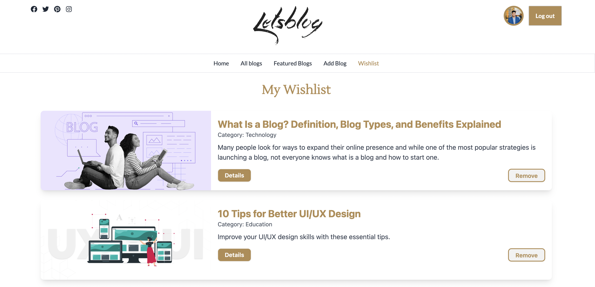

<div align="center">

# ✍️ Let's Blog

### *A Dynamic Blog Platform — Read, Write & Connect*

[](https://blog-app-d54d1.web.app)
[](https://reactjs.org/)
[](https://firebase.google.com/)
[](https://mongodb.com/)

</div>

---

## 📸 Preview

| Homepage | Blog Details | Featured Blogs | Wishlist |
|:--------:|:------------:|:--------------:|:--------:|
|  |  |  |  |

---

## 📌 Overview

**Let's Blog** is a full-stack blogging platform where users can explore, write, and engage with blog posts. It features a rich commenting system, personal wishlists, category filtering, and secure authentication — all wrapped in a smooth, fully responsive UI.

> 🔗 **Live Site:** [https://blog-app-d54d1.web.app](https://blog-app-d54d1.web.app)

---

## ✨ Key Features

| Feature | Description |
|---|---|
| 🔐 **Authentication** | Email/password + Google, Facebook & GitHub via Firebase |
| 📝 **Blog Management** | Create, update, and delete your own blog posts |
| 🔖 **Wishlist** | Save and manage favourite blogs (authenticated users only) |
| 💬 **Comments** | Comment on any blog; owners cannot comment on their own |
| 🏆 **Featured Blogs** | Top blogs ranked by description length |
| 🔍 **Search & Filter** | Search by title, filter by category |
| 📧 **Newsletter** | Subscribe with toast confirmation |
| 🔒 **Private Routes** | Protected pages for authenticated users |
| 🚫 **Custom 404** | Friendly error page for invalid routes |

---

## 🖥️ Tech Stack

### Frontend


### Backend


### Deployment


---

## 📁 Project Structure

```
lets-blog/
├── client/                     # React frontend
│   ├── src/
│   │   ├── components/         # Reusable UI components
│   │   ├── pages/              # Home, BlogDetails, Wishlist, Login, 404
│   │   ├── context/            # Auth & global state (Context API)
│   │   ├── hooks/              # Custom React hooks
│   │   └── routes/             # Protected & public routes
│   └── package.json
│
└── server/                     # Express backend
    ├── routes/                 # API route definitions
    ├── controllers/            # Business logic
    ├── models/                 # Mongoose schemas (Blog, User, Comment)
    ├── middleware/             # JWT auth, error handling
    └── package.json
```

---

## ⚙️ Getting Started

### Prerequisites
- Node.js `v18+`
- MongoDB (local or Atlas)
- Firebase project with Authentication enabled

### Installation

```bash
# Clone the repository
git clone https://github.com/DKAbir111/Let-s-Blog-Client.git
cd Let-s-Blog-Client

# Install client dependencies
npm install

# Clone and set up the server
git clone <server-repo-url>
cd server && npm install
```

### Running the App

```bash
# Start the backend server
cd server
npm start

# Start the frontend
cd client
npm run dev
```

---

## 🔐 Environment Variables

Create a `.env` file in the **server** directory:

```env
MONGODB_URI=your_mongodb_connection_string
JWT_SECRET=your_jwt_secret
```

Create a `.env` file in the **client** directory:

```env
VITE_FIREBASE_API_KEY=your_api_key
VITE_FIREBASE_AUTH_DOMAIN=your_auth_domain
VITE_FIREBASE_PROJECT_ID=your_project_id
```

---

## 🚀 Roadmap

- [ ] Rich text editor for writing blogs (e.g., TipTap or Quill)
- [ ] Blog tags and advanced filtering
- [ ] Like / reaction system on posts
- [ ] User profile pages with published blog history
- [ ] Admin panel for content moderation

---

## 👤 Author

**Darun Karas Abir**

[](https://github.com/DKAbir111)

---

<div align="center">

⭐ **If you like this project, give it a star!** ⭐

*Built with ❤️ — Keep Writing, Keep Growing!*

</div>
