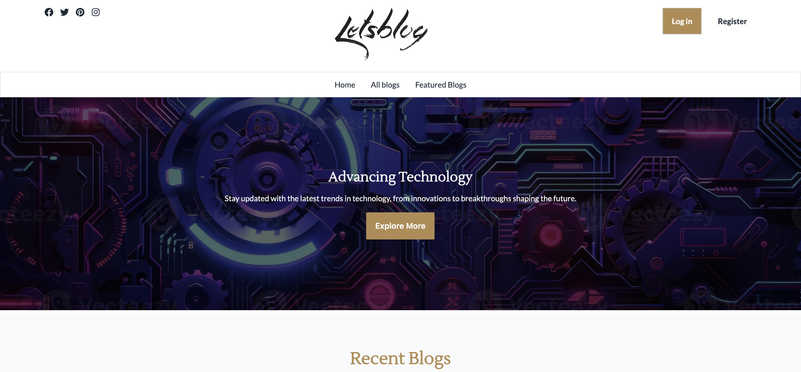
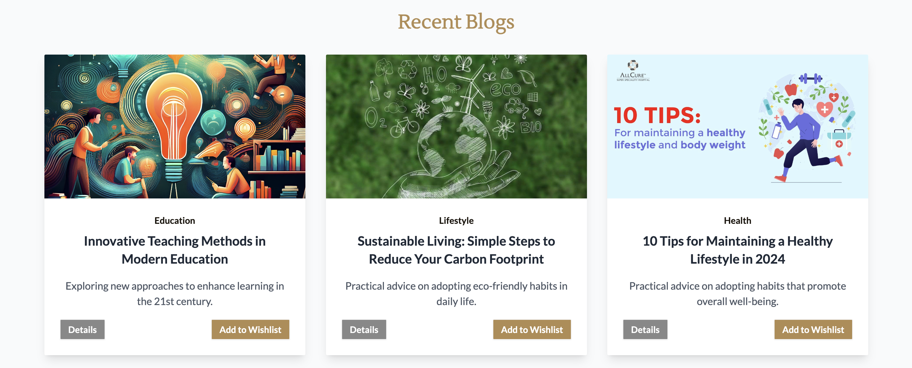

## Project Name Lets Blog

## Purpose
The purpose of this project is to develop a dynamic and responsive blog platform where users can read, write, and interact with blog posts. It incorporates authentication, blog management, wishlist functionality, and dynamic routing. The application is designed to offer a seamless user experience on all devices and encourages engagement through commenting, subscribing to newsletters, and exploring featured blogs.

---

## Key Features

### Frontend Features
- **Responsive Design**: Fully responsive across mobile, tablet, and desktop.
- **Homepage**: Features a banner, recent blog posts section, newsletter subscription, and extra sections like "Tips" to make the site stand out.
- **Authentication System**: Email/password-based login and registration. Includes additional login options like Google, Facebook, or GitHub.
- **Dynamic Blog Pages**: Blogs can be filtered by category, searched by title, and displayed with key properties like title, image, description, and category.
- **Wishlist**: Logged-in users can add blogs to their wishlist and view them on the wishlist page.
- **Blog Details Page**: Displays detailed information about a specific blog, including the ability for users to comment (with restrictions for blog owners).
- **Featured Blogs**: Displays top blogs based on the length of the blog's description.
- **Newsletter Subscription**: Users can subscribe to the newsletter and receive a toast message upon successful subscription.
- **404 Page**: A custom page for invalid routes.
- **Private Routes**: Ensures that only logged-in users can access certain pages (like adding or updating blogs).

### Backend Features
- **Authentication**: Firebase Authentication handles user sign-up and login using email/password and social login options like Google, Facebook, and GitHub.
- **MongoDB**: Stores blog posts, comments, wishlist data, and user information.
- **CRUD Operations**: Allows users to add, update, and delete blog posts. Includes functionality to manage comments and wishlists.
- **JWT Authentication**: Protects private routes by validating JWT tokens.
- **API Routes**: Backend routes for handling user registration, login, blog CRUD, comment system, and wishlist management.
- **Secure Environment Variables**: Firebase and MongoDB credentials are stored securely using environment variables.
- **Server-Side Filtering**: Server-side queries for filtering wishlist data and searching for blogs by title or category.

---

## Technologies Used

- **Frontend**:
  - **React**: For building the user interface.
  - **Firebase Authentication**: For handling user login and registration.
  - **React Context API**: For global state management (for example, user authentication status and wishlist).
  - **Framer Motion**: For smooth page transitions and animations.
  - **Material-UI** / **React-Bootstrap**: For UI components and styling.
  - **Axios** or **Fetch**: For data fetching.
  - **React Router**: For routing between pages.
  - **MongoDB Atlas**: For managing and storing blog and user data.
  - **React Intersection Observer** (Optional): For animations triggered when elements come into view.
  - **React-Loading-Skeleton** (Optional): For loading skeletons during data fetching.

- **Backend**:
  - **Node.js**: JavaScript runtime for building the server-side application.
  - **Express.js**: Web framework for handling routing and requests.
  - **MongoDB**: NoSQL database for storing blogs, users, and comments.
  - **Mongoose**: MongoDB object modeling library.
  - **JWT**: JSON Web Tokens for securing private routes.
  - **dotenv**: For managing environment variables.
  - **Firebase Admin SDK**: To interact with Firebase services like Authentication on the backend.

---

## Key NPM Packages Used

### Frontend (Client-side)
- `react`: For building the user interface.
- `react-router-dom`: For routing and navigation.
- `firebase`: Firebase SDK for authentication.
- `axios`: For making HTTP requests to the backend.
- `framer-motion`: For animations and page transitions.
- `@mui/material`: Material-UI components library.
- `react-bootstrap`: For responsive, Bootstrap-based components.
- `react-context-api`: For managing global state.
- `react-loading-skeleton`: For displaying skeleton loading screens.
- `react-photo-view`: For full-screen image previews.
- `react-intersection-observer`: For implementing intersection animations.

### Backend (Server-side)
- `express`: Web framework for routing and handling HTTP requests.
- `mongoose`: MongoDB ODM for defining models and interacting with MongoDB.
- `dotenv`: For managing environment variables securely.
- `jsonwebtoken`: For handling JWT-based authentication.
- `cors`: For handling cross-origin requests.
- `firebase-admin`: Firebase Admin SDK for server-side Firebase interactions.
- `bcryptjs`: For hashing passwords.
- `body-parser`: For parsing incoming request bodies.
- `nodemon`: For automatic server restarts during development.

---

## Live URL
[https://blog-app-d54d1.web.app]

---

## Installation and Setup

### 1. Clone the repository:

```bash
git clone <https://github.com/DKAbir111/Let-s-Blog-Client.git>
cd Blog-Website

## Snapshots







